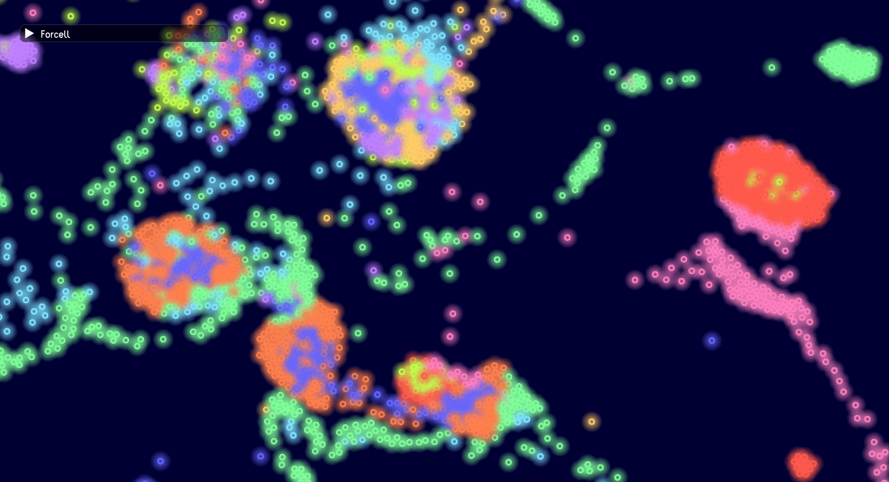
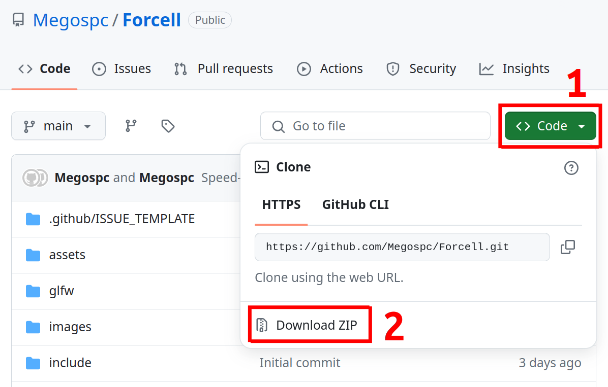

<h1 align="center">🧲 Forcell 🧬</h1>

<p align="center">
    
    
    
    
    
    <a href="https://megospc.github.io/ForcellDemo">
        
    </a>
</p>

Forcell is a particle life simulation with new features and Multi-threaded computing on CPU.

[Online demo on GitHub Pages](https://megospc.github.io/ForcellDemo)

Version: 1.8.0 (11.07.2024)

## ✨ Features
+ Particles connections
+ Multi-threaded computing on CPU
+ Supporting Ubuntu and Windows
+ Fullscreen mode
+ Create random rules with two clicks
+ Export/Import rules as files
+ Style customizing

## 📸 Screenshots



<video src="https://github.com/Megospc/Forcell/assets/97227980/30c19aab-7b5b-4229-ad5a-ef3bfe80a514"></video>

## 💿 Pre-compiled Binaries
(Only for x64 processors)
You can download pre-compiled binaries in [releases](https://github.com/Megospc/Forcell/releases).

## ▶️ How To Build
### 🔧 What You Need
For Windows:
+ MinGW-w64
+ CMake
+ GNU Make

For Ubuntu, these packages:
+ gcc
+ cmake
+ libgtk-3-dev
+ make

### 📄 Steps
1. Download zip-archive with source code.\
    
2. Extract the archive.
3. (Only for windows) Open `run.bat` in Notepad and edit compiler and make paths if needed.
4. Open folder with `CMakeLists.txt` in terminal.
5. Enter these commands:
```Bash
# Ubuntu
bash ./run.sh

# Windows
./run.bat
```
6. Wait for compilation to complete.
7. The Forcell's window should open.
8. Then you can open `Forcell.exe` (`Forcell` for Ubuntu) to run it again.

## ⚙️ System Requirements
+ OpenGL 3.3 compatible GPU

## 😃 Dependicies
There are these libraries used in this project:
+ [Dear ImGui](https://github.com/ocornut/imgui)
+ [GLFW 3.4](https://github.com/glfw/glfw)
+ [GLAD](https://github.com/dav1dde/glad-web)
+ [ImGuiFileDialog](https://github.com/aiekick/ImGuiFileDialog)
+ [STB](https://github.com/nothings/stb)
+ [vecpp](https://github.com/Megospc/vecpp)

## 🐞 Bug Reporting
If you find any error, please [create](https://github.com/Megospc/Forcell/issues/new?assignees=&labels=&projects=&template=bug_report.md&title=) an Issue about it.